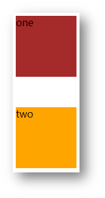
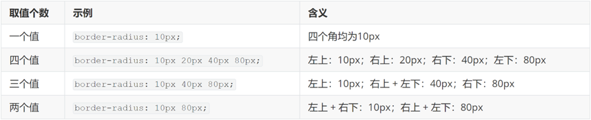

# css进阶

# 一.盒子模型

### 01-结构伪类选择器 （孩子选择器）

- **基本使用** (掌握)

作用：根据元素的**结构关系**查找元素。 


```css
li:first-child {
  background-color: green;
}
```

- **:nth-child(公式)** (掌握)


> 提示：公式中的n取值从 **0** 开始。 

### 02-伪元素选择器 

作用：创建**虚拟元素**（伪元素），用来**摆放装饰性的内容**。 


```css
div::before {
  content: "before 伪元素";
}
div::after {
  content: "after 伪元素";
}
```

注意点：

* 必须设置 **content: ””属性**，用来 设置伪元素的内容，如果没有内容，则**引号留空**即可
* 伪元素默认是**行内**显示模式
* **权重和标签选择器相同**

### 03-盒子模型

作用：布局网页，摆放盒子和内容。

#### 3-1盒子模型-组成

* 内容区域 – width & height
* 内边距 – padding（出现在内容与盒子边缘之间）
* 边框线 – border 
* 外边距 – margin（出现在盒子外面）

```css
div {
  margin: 50px;
  border: 5px solid brown;
  padding: 20px;
  width: 200px;
  height: 200px;
  background-color: pink;
}
```


#### 3-2边框线

- **四个方向**

属性名：**border** 属性值：边框线粗细  线条样式  颜色

solid 实线 dashed 虚线 dotted点线

```css
div {
  border: 5px solid brown;
  width: 200px;
  height: 200px;
  background-color: pink;
}
```

- **单方向边框线** 

属性名：**border-方位名词**

属性值：边框线粗细  线条样式  颜色

```css
  border-top: 2px solid red;
  border-right: 3px dashed green;
  border-bottom: 4px dotted blue;
  border-left: 5px solid orange;
```

#### 3-3内边距 

作用：设置 内容 与 盒子边缘 之间的距离。（添加 padding 会撑大盒子）

* 属性名：padding / padding-方位

```css
div {
  /* 四个方向 内边距相同 */
  padding: 30px;
  /* 单独设置一个方向内边距 */
  padding-top: 10px;
  padding-right: 20px;
  padding-bottom: 40px;
  padding-left: 80px;
  width: 200px;
  height: 200px;
  background-color: pink;
}
```

* padding 多值写法


> 从**上**开始**顺时针**赋值，当前方向没有数值则与**对面取值相同**。 

#### 3-4外边距 

作用：拉开两个盒子之间的距离

属性名：**margin**

提示：与 padding 属性值写法、含义相同

#### 3-5版心居中

左右 margin 值 为 auto（盒子要有宽度）

```css
div {
  margin: 0 auto;
  width: 1000px;
  height: 200px;
  background-color: pink;
}
```


### 04-元素溢出

作用：控制溢出元素的内容的显示方式。

属性名：**overflow**


### 05-外边距问题（掌握）

- **合并现象**

场景：**垂直**排列的兄弟元素，上下 **margin** 会**合并**

现象：取两个 margin 中的**较大值生效**



```css
.one {
  margin-bottom: 50px;
}
.two {
  margin-top: 20px;
}
```

- **外边距塌陷**

场景：父子级的标签，子级的添加 **上外边距** 会产生**塌陷**问题

现象：**导致父级一起向下移动**

```css
.son {
  margin-top: 50px;
  width: 100px;
  height: 100px;
  background-color: orange;
}
```


解决方法：

* 取消子级margin，父级设置padding；父级设置 overflow: hidden；父级设置 border-top

### 行内元素 – 内外边距问题 

场景：行内元素添加 margin 和 padding，无法改变元素垂直位置

解决方法：给行内元素添加 **line-height** 可以改变垂直位置

```css
span {
  /* margin 和 padding 属性，无法改变垂直位置 */
  margin: 50px;
  padding: 20px;
  /* 行高可以改变垂直位置 */
  line-height: 100px;
}
```

### 06-圆角

作用：设置元素的外边框为圆角。

属性名：**border-radius**

属性值：数字+px / 百分比

提示：属性值是圆角半径


* 多值写法



> 技巧：从左上角开始顺时针赋值，当前角没有数值则与对角取值相同。 

* **正圆形状**：给正方形盒子设置圆角属性值为 **宽高的一半 / 50%**

```css
img {
  width: 200px;
  height: 200px;
  
  border-radius: 100px;
  border-radius: 50%;
}
```

* **胶囊形状**：给长方形盒子设置圆角属性值为 盒子高度的一半 

```css
div {
  width: 200px;
  height: 80px;
  background-color: orange;
  border-radius: 40px;
}
```


### 07-盒子阴影

作用：给元素设置阴影效果

属性名：**box-shadow**

属性值：X 轴偏移量  Y 轴偏移量  模糊半径  扩散半径  颜色  内外阴影

注意： 

* X 轴偏移量 和 Y 轴偏移量 必须书写
* 默认是外阴影，内阴影需要添加 inset

```css
div {
  width: 200px;
  height: 80px;
  background-color: orange;
  box-shadow: 2px 5px 10px 0 rgba(0, 0, 0, 0.5) inset;
}
```

## 二.Flex布局

### 01-文档流

标准流也叫文档流，指的是标签在页面中**默认的排布规则**，例如：块元素独占一行，行内元素可以一行显示多个。 

### 02-浮动

作用：让块元素水平排列。(display :block 将行内元素转化成块级元素)

属性名：**float**

属性值  **left**：左对齐   **right**：右对齐

特点：

* 浮动后的盒子**顶对齐**
* 浮动后的盒子具备**行内块**特点
* 浮动后的盒子**脱标**（脱离文档流），**不占用标准流的位置**

```html
<style>
  /* 特点：顶对齐；具备行内块显示模式特点；浮动的盒子会脱标 */
  .one {
    width: 100px;
    height: 100px;
    background-color: brown;
    float: left;
  }
  .two {
    width: 200px;
    height: 200px;
    background-color: orange;
    /* float: left; */
    float: right;
  }
</style>
<div class="one">one</div>
<div class="two">two</div>
```

### 03-清除浮动（待补充）

场景：浮动元素会脱标，如果**父级没有高度**，**子级无法撑开父级高度**（可能导致页面布局错乱）

解决方法：**清除浮动**（清除浮动带来的影响）

在**父元素内容的最后**添加一个**块级**元素，设置 CSS 属性 **clear: both** （用于清除浮动的属性）


### 04-Flex布局

Flex 布局也叫**弹性布局**，是浏览器**提倡的布局模型**，非常适合**结构化**布局，提供了强大的空间分布和对齐能力。

Flex 模型不会产生浮动布局中脱标现象，布局网页更简单、更灵活。

#### 4-1 flex使用方式

设置方式：给**父**元素设置 **display: flex**，子元素可以自动挤压或拉伸

组成部分：

* 弹性容器
* 弹性盒子
* 主轴：默认在**水平**方向
* 侧轴 / 交叉轴：默认在**垂直**方向
* 


#### 4.2 **flex-direction**  设置主轴及主轴方向

- row        从左至右水平线
- row-reverse    从右至左水平线
- column      从上至下垂直线  
- column-reverse  从下至上垂直线

#### 4.3 justify-content  主轴对齐方式

- `flex-start`（默认值）：主轴起点对齐 【从主轴起点开始 依次排列项目 没有间距】
- `flex-end`：主轴终点对齐【从主轴终点开始 依次排列项目 没有间距】
- `center`： 居中
- `space-between`：两端对齐，项目之间的间隔都相等。
- `space-around`：每个项目两侧的间隔相等。所以，项目之间的间隔比项目与边框的间隔大一倍。

- `space-evenly `    每个盒子的间距 和 左右间距都是相同的  

#### 4.4   align-items     单个侧轴的对齐方式

- `flex-start`：（默认值：前提 项目都有高宽）交叉轴的起点对齐。
- `flex-end`：交叉轴的终点对齐。
- `center`：交叉轴的中点对齐。
- `baseline`: 项目的第一行文字的基线对齐。
- `stretch`（默认值 项目没有高宽，侧轴方向的高宽被拉满）：如果项目未设置高度或设为auto，将占满整个容器的高度。

#### 4.5   flex-wrap  换行 

- nowrap   （默认值）不换行 （项目高宽压缩）

- wrap      换行 且 第一行在上方  
- wrap-reverse  换行 且第一行在下方

```css
.box{
  flex-wrap: nowrap | wrap | wrap-reverse;
}
```

#### 4.6     align-content     多个侧轴对齐方式

- `flex-start`：与侧轴的起点对齐。
- `flex-end`：与侧轴的终点对齐。
- `center`：与侧轴的中点对齐。
- `space-between`：与侧轴两端对齐，轴线之间的间隔平均分布。
- `space-around`：每根轴线两侧的间隔都相等。所以，轴线之间的间隔比轴线与边框的间隔大一倍。
- `stretch`（默认值）：轴线占满整个交叉轴。
- `space-evenly `    每行的间距相同

```css
.box {
  align-content: flex-start | flex-end | center | space-between | space-around | stretch;
}
```


#### 4.7 flex-flow  设置主轴和是否换行[缩写 了解]

```css
.box {
  flex-flow: <flex-direction> || <flex-wrap>;
  }
```

### 05-项目属性

#### 5.1 order 设置项目的出场顺序

> 数字：默认值为0      出场顺序：由小到大 可以是负数

```css
.box1{
    order:数字;    
}
```

```css
  .box1{
            order: 0;
        }
        
        .box1:nth-child(6){
            order: -1;
        }
```

#### 5.2 flex-grow   放大比例(将剩余空间 占据多少份分给这个盒子)

> 如果所有的项目排列完成后  空间还有剩余的 

> 数字： 可以小数 也可以正整数    >=0

```css
  .box1{
            width: 200px;
            height: 200px;
            border: 1px solid #f60;
        }
        .box1:first-child{
            flex-grow: 0.5;
        }
       
        .box1:nth-child(2){
            flex-grow: 2.5;
        }
        .box1:nth-child(3){
            flex-grow: 1.5;
        }
        .box1:last-child{
            flex-grow: 0.5;
        }
```

#### 5.3  flex-shrink 缩小倍数(将超出空间 占据多少份分给这个盒子)

> 如果所有的项目排列完成后  总项目高宽 超出了 容器的高宽 ，需要扣除均分超出部分

> 数字： 可以小数 也可以正整数     默认值：1

```css
 .box{
            width: 1000px;
            height: 200px;
            border:  1px solid green;
            display: flex;

        }
        .box1{
            width: 200px;
            height: 200px;
            border: 1px solid #f60;
        }
        .box1:first-child{
            flex-shrink: 2;
        }
        .box1:nth-child(2){
            flex-shrink: 2;
        }
        .box1:nth-child(3){
            flex-shrink: 0;
        }
        .box1:nth-child(4){
            flex-shrink: 0;
        }
        .box1:nth-child(5){
            flex-shrink: 0;
        }
        .box1:nth-child(6){
            flex-shrink: 0;
        }
     
```

#### 5.4  flex-basis 固定大小

> 不放大 也不缩小 强制设置为这个值
>
> 设置了高宽，但是受弹性布局的影响 高宽又被更改了，强制设置为这个高宽值

```css
.box1:nth-child(3){
            /*先设置 放大和缩小倍数为0   */
            flex-grow: 0;
            flex-shrink: 0;
            flex-basis:300px;
       }
```


#### 5.5 flex 设置放大 缩小 固定值

> 如果只需要设置 放大值 ，就写一个参数即可  
>
> 设置缩小值  必须前面两个  

```css
flex:放大值  缩小值 固定值;     
```

```css
flex:0 1  0;
```

```css
 .box1:first-child{
            flex:0 0 250px;
        }
        .box1:nth-child(2){
            flex:0 0 250px;
        }
        .box1:nth-child(3){
            /* flex-shrink: 1; */
            flex:0 1 auto;
        }
        .box1:nth-child(4){
            /* flex-shrink: 1; */
            flex: 0 1 auto;
        }
        .box1:nth-child(5){
            flex:0 0 180px;
        }
        .box1:nth-child(6){
            flex:0 0 180px;
        }
```

```html
<!-- 菜单1 2  设置为200 固定宽度-->
     <!-- 菜单3 4 设置为100 固定宽度 -->
      <!-- 菜单5  设置为450   -->
    <!-- 菜单6 自动弹性宽度 -->


    <!-- 菜单1 和菜单2  需设置为250px -->
     <!-- 3 4 均分超出部分的宽度 -->
      <!-- 5 6 设置固定值为180px -->
    <div class="box">
        <div class="box1">菜单01</div>
        <div class="box1">菜单02</div>
        <div class="box1">菜单03</div>
        <div class="box1">菜单04</div>
        <div class="box1">菜单05</div>
        <div class="box1">菜单06</div>
    </div>
```

