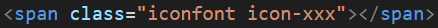
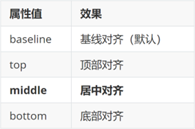

# CSS高级

> 目标：掌握定位的作用及特点；掌握 CSS 高级技巧

## 01-定位（重点）

作用：灵活的改变盒子在网页中的位置

实现：

1.定位模式：position

2.边偏移：设置盒子的位置

* left
* right
* top
* bottom

### 1.1相对定位

**position: relative**

特点：

* 不脱标，占用自己原来位置
* 显示模式特点保持不变
* 设置边偏移则相对自己原来位置移动

```css
div {
  position: relative;
  top: 100px;
  left: 200px;
}	
```

### 1.2绝对定位

**position: absolute**

使用场景：子级绝对定位，父级相对定位（**子绝父相**）

特点：

* 脱标，不占位
* 显示模式具备行内块特点
* 设置边偏移则相对最近的已经定位的祖先元素改变位置
* 如果祖先元素都未定位，则相对浏览器可视区改变位置

```css
.father {
  position: relative;
}

.father span {
  position: absolute;
  top: 0;
  right: 0;
}
```

### 1.3定位居中


实现步骤：

1. 绝对定位
2. 水平、垂直边偏移为 50%
3. 子级向左、上移动自身尺寸的一半

* 左、上的外边距为 –尺寸的一半
* transform: translate(-50%, -50%)

```css
img {
  position: absolute;
  left: 50%;
  top: 50%;

  /* margin-left: -265px;
  margin-top: -127px; */

  /* 方便： 50% 就是自己宽高的一半 */
  transform: translate(-50%, -50%);
}
```

### 1.4固定定位

**position: fixed**

场景：元素的位置在网页滚动时不会改变

特点：

* 脱标，不占位
* 显示模式具备行内块特点
* 设置边偏移相对浏览器窗口改变位置

```css
div {
  position: fixed;
  top: 0;
  right: 0;

  width: 500px;
}
```

### 1.5堆叠层级z-index（掌握）


默认效果：按照标签书写顺序，后来者居上

作用：设置定位元素的层级顺序，改变定位元素的显示顺序

属性名：**z-index**

属性值：**整数数字**（默认值为0，取值越大，层级越高）

```css
.box1 {
  background-color: pink;
  /* 取值是整数，默认是0，取值越大显示顺序越靠上 */
  z-index: 1;
}

.box2 {
  background-color: skyblue;
  left: 100px;
  top: 100px;

  z-index: 2;
}
```

## 02-高级技巧

### 2.1CSS精灵（待补充）

CSS 精灵，也叫 **CSS Sprites**，是一种网页**图片应用处理方式**。把网页中**一些背景图片**整合到**一张图片**文件中，再**background-position** 精确的定位出背景图片的位置。


优点：减少服务器被请求次数，减轻服务器的压力，提高页面加载速度


实现步骤：

1. 创建盒子，**盒子尺寸**与**小图**尺寸**相同**
2. 设置盒子**背景图**为精灵图
3. 添加 **background-position** 属性，改变**背景图位置**

​       3.1 使用 PxCook 测量小图片**左上角坐标**

​       3.2 取**负数**坐标为 background-position 属性值（向左上移动图片位置）

### 2.2字体图标 [图标库](https://www.iconfont.cn/)


字体图标：**展示的是图标，本质是字体**

作用：在网页中添加**简单的、颜色单一**的小图标

优点

* **灵活性**：灵活地修改样式，例如：尺寸、颜色等
* **轻量级**：体积小、渲染快、降低服务器请求次数
* **兼容性**：几乎兼容所有主流浏览器
* **使用方便**：先下载再使用

#### 2.3下载字体

iconfont 图标库：<https://www.iconfont.cn/> 

登录 → 素材库 → 官方图标库 → 进入图标库 → 选图标，加入购物车 → 购物车，添加至项目，确定 → 下载至本地 


#### 2.4使用字体

1. 引入字体样式表（iconfont.css） 


2. 标签使用字体图标类名
   * iconfont：字体图标基本样式（字体名，字体大小等等）
   * icon-xxx：图标对应的类名



#### 2.5上传矢量图

作用：项目特有的图标上传到 iconfont 图标库，生成字体


上传步骤：上传 → 上传图标 → 选择 svg 矢量图，打开 → 提交 → 系统审核

## 03-CSS修饰属性

### 3.1垂直对齐方式 


属性名：vertical-align



### 3.2过渡(重点)

作用：可以为一个元素在不同状态之间切换的时候添加**过渡效果**

属性名：**transition（复合属性）**

属性值：**过渡的属性  花费时间 (s)**

提示：

* 过渡的属性可以是具体的 CSS 属性
* 也可以为 all（两个状态属性值不同的所有属性，都产生过渡效果）
* transition 设置给元素本身

```css
img {
  width: 200px;
  height: 200px;
  transition: all 1s;
}

img:hover {
  width: 500px;
  height: 500px;
}
```

### 3.3透明度opacity

作用：设置**整个元素的透明度**（包含背景和内容）

属性名：opacity

属性值：0 – 1

* 0：完全透明（元素不可见）
* 1：不透明
* 0-1之间小数：半透明

### 3.4光标类型cursor

作用：鼠标悬停在元素上时指针显示样式

属性名：cursor


## 前端基础 CSS3 变形 动画

- CSS3渐变（重点）
- 变形  
  - 平移
  - 缩放
  - 旋转
  - 斜切
- 动画
  - 动画定义
  - 动画使用
  - 动画属性
  - JS操作


## 01-css3 渐变

### 1.1 线性渐变

> 方向值: 通过点位    常用9个点    left bottom       top       
>
> 通过角度  90deg  180deg

```css
background:linear-gradient(角度值,颜色值1，颜色2，颜色3...)
background:linear-gradient(to 点位值,颜色值1，颜色2，颜色3...)
```

### 1.2 径向渐变

```css
background:radial-gradient(颜色值1，颜色2，颜色3...)
```

```css
   .box{
            width: 300px;
            height: 100px;
            border: 1px solid red;
            /* 线性渐变 */
            background: linear-gradient(to top right,red,green,blue);
        }
        .box1{
            width: 300px;
            height: 300px;
            border-radius: 50%;
            /* 径向渐变 */
            background:radial-gradient(#b4d2ec,#c4e9ad) ;
        }
```

### 1.3 重复渐变 [了解]

> 一个颜色设置占比后 重复出现多次 

- 重复线性渐变

```css
background:linear-gradient(角度值,颜色值1 10%，颜色2 15%，颜色3 20%...)
background:linear-gradient(to 点位值,颜色值1 10%，颜色2 15%，颜色3 20%...)
```

```css
   .box{
            width: 300px;
            height: 100px;
            border: 1px solid red;
            /* 重复线性渐变 */
            background: linear-gradient(to top right,red 10%,green 20%,blue 30%);
        }
        .box1{
            width: 300px;
            height: 300px;
            border-radius: 50%;
            /* 重复径向渐变 */
            background:radial-gradient(#b4d2ec 10%,#c4e9ad 10%) ;
        }
```

### 1.4 文字渐变

```css
  background:linear-gradient(to bottom,red,#fd8403,yellow); 
 background-clip:text;   //以文字区域进行截取  
  -webkit-text-fill-color:transparent;  //文字区域 清除默认填充色

```

## 02-变形  transform

### 2.1 平移 translate

> 平移位置： 300px(相对于现在的位置 平移300px)     
>
> 百分比值 100%：如果是x轴平移 相当于盒子宽度        如果y轴平移 相当于盒子高度   
>
> px 和%值都支持负数，负数就是向上和 向左平移

```
transform:translate(x轴平移的位置,y轴平移的位置)
x 轴平移： transform:translateX(x轴平移的位置)
Y轴平移： transform:translateY(Y轴平移的位置)
```

- 盒子居中

```css
//父盒子有宽高即可
display：flex;
justify-content:center;
align-items:center;
```

```css
//定位宽高减半 知道子盒子高宽 300*300
position:absloate;
top:50%;
left:50%;
margin-left:-150px;
margin-top:-150px;

position:absloate;
top:calc(50% - 150px);
left:calc(50% - 150px);

```

```css
//四角拉扯 子盒子必须有宽高
position:absloate;
top:0;
left:0;
right:0;
bottom:0;
margin:auto;
```

```css
//最完美的盒子居中 不需要知道父盒子高宽 不需要子盒子高宽
position:absloate;
top:50%;
left:50%;
transform:translate(-50%,-50%);
```

### 2.2 缩放 scale 

> 缩放倍数: 纯数字  支持小数   （不能写负数）
>
> 倍数<1  缩小为原来的多少倍
>
> 倍数==1  不放大 不缩小
>
> 倍数>1  放大为原来的多少倍

```css
transform:scale(X轴缩放倍数,Y轴缩放倍数);
X轴缩放 transform:scaleX(X轴缩放倍数);
Y轴缩放 transform:scaleY(y轴缩放倍数);
如果x轴和y轴都缩放同样的倍数：  transform:scale(缩放倍数)
```

```css
  <style>
        .box{
            margin: 200px ;
            width: 300px;
            height: 200px;
            background: antiquewhite;
            /* 宽600  高400 */
            transform: scale(0.5);
            /* transform: scaleX(0.5); */
        }
    </style>
```

- 案例 图片网站缩放效果  11:15

> 外层盒子 宽高固定， 图片盒子 transform scale 进行放大， 外层设置溢出隐藏  
>
> 鼠标移入 移出 通过 ：hover 
>
> 移入时 缓慢放大 ，设置过渡效果  `transition:css属性名| all  时长s 快慢曲线 `

```html
   .box{
            width: 500px;
            height: 250px;
            margin: 200px;
            border: 1px solid red;
            border-radius: 25px;
            /* 溢出隐藏 */
            overflow: hidden;
        }
        .box img{
            display: block;
            width: 500px;
            height: 250px;
            /* 过渡效果 */
            transition: all .5s;
        }
        .box img:hover{
    
            transform: scale(1.5);
        }
        .desc{
            background: rgba(0,0,0,.5);
            color: #fff;
        }

    </style>
</head>
<body>
    <div class="box">
        
        <!-- <div class="desc">惊蛰，学习成绩阿是不是等哈说</div> -->
    </div>
```

> 移入大盒子  里面的图片缓慢放大
>
> 移入大盒子  里面的文本盒子 缓慢向上移动 平移
>
> 缓慢变化 过渡效果：图片  文本 

```html
   <style>
        .box{
            width: 500px;
            height: 250px;
            margin: 200px;
            border: 1px solid red;
            border-radius: 25px;
            /* 溢出隐藏 */
            overflow: hidden;
           
        }
        .box img{
            display: block;
            width: 500px;
            height: 250px;
            transition:all .5s;
        }
        /* 移入大盒子 修改大盒子中的img标签的样式 */
        .box:hover img{
            transform: scale(1.5);
        
        }
        .box:hover .desc{
            transform: translateY(-40px);
            transition:all .5s;
            
        }
        .desc{
            background: rgba(0,0,0,.5);
            color: #fff;
            padding: 10px 20px;
          
        }

    </style>
</head>
<body>
    <div class="box">
        
        <div class="desc">惊蛰，学习成绩阿是不是等哈说</div>
    </div>
```


### 2.3  翻转旋转 rotate 

> 角度值： 180deg  110deg   可以是无限大的值 支持负数

```css
transform:rotate(旋转角度值 deg)
transform:rotateX(x轴翻转角度值)
transform:rotateY(Y轴翻转角度值)
transform:rotateZ(旋转角度值 deg)
```

```css
<head>
    <meta charset="UTF-8">
    <meta name="viewport" content="width=device-width, initial-scale=1.0">
    <title>Document</title>
    <style>
        div{
            width: 300px;
            height: 200px;
            background: antiquewhite;
            font-size: 40px;
            color: blue;
            margin:200px;
            transition: all 3s;
        }
        div:hover{
            /* 刚好翻转到横截面 消失了 90  半圈  一圈半 两圈半....都会消失 */
            /* transform: rotateX(180deg); */
            /* transform: rotateY(180deg); */
            transform: rotateZ(3600deg);
        }
    </style>
</head>
<body>
    <div class="box">滚</div>
</body>
```


- 旋转原点

> 值：  可以  top left    right bottom      bottom center 
>
> ​       50%  50%     100% 0  
>
> ​       300px  200px       超出范围 百分比或者px值表示

```css
transform-origin:50% 50%;
```

```css
 <style>
        .box{
            width: 200px;
            height: 200px;
            border-radius: 50%;
            background: radial-gradient(#fff,#000);
            text-align: center;
            line-height: 200px;
            font-size: 50px;
            transition: all 2s;
        }
        .box:hover{
            transform: translateX(500px) rotate(3600deg);
        }
    </style>
</head>
<body>
    <div class="box">滚</div>
</body>
```

### 2.4 斜切  skew 

> 斜切的角度

```css
transform:skew(角度值)   //x 和y 都倾斜这个角度
transform:skewX(角度值)  
transform:skewY(角度值)
```

```css
    <title>Document</title>
    <style>
        .box{
            margin: 200px;
            width: 200px;
            height: 200px;
            background: aquamarine;
            transition: all 2s;
         
        }
        .box:hover{
            transform: skew(90deg);
        }
    </style>
</head>
<body>
    <div class="box"></div>
```


## 03.动画定义与使用

### 3.1  关键帧的定义  动画定义 

```css
@keyframes 关键帧名字/动画名{
    //起始帧
    from{
        //css样式 --默认开始的样式 
    }
     //结束帧
    to{
      //css样式--结束的式样  
    }
   
}
```

- 多个关键帧的定义 

```css
        @keyframes run{
            0%{
             transform: translate(0,0) rotate(0);
            }
            25%{
                transform: translate(800px,0) rotate(1960deg);  
            }
            50%{
                transform: translate(800px,500px) rotate(2960deg);  
            }
            75%{
                transform: translate(0,500px) rotate(4960deg);  
            }

            100%{
                transform: translate(0,0) rotate(6960deg);  
            }
        }
        .box{
            width: 200px;
            height: 200px;
            background: radial-gradient(#fff,#000);
            border-radius: 50%;
            text-align: center;
            line-height: 200px;
            animation: run 10s;
        }
```


### 3.2 使用关键帧/动画

```css
.box{
    animation:动画名 动画执行时长 等待时长  过渡类型 ....;
}
```

```css
  @keyframes run{
            0%{
             transform: translate(0,0) rotate(0);
            }
            25%{
                transform: translate(800px,0) rotate(1960deg);  
            }
            50%{
                transform: translate(800px,500px) rotate(2960deg);  
            }
            75%{
                transform: translate(0,500px) rotate(4960deg);  
            }

            100%{
                transform: translate(0,0) rotate(6960deg);  
            }
        }
        @keyframes text{
            0%{
                opacity: 0;

            }
            100%{
               opacity: 1;
            }
        }
        .box{
            width: 200px;
            height: 200px;
            background: radial-gradient(#fff,#000);
            border-radius: 50%;
            text-align: center;
            line-height: 200px;
            animation: run 10s;
        }

        .text{
            font-size: 26px;
            opacity: 0;
            animation: text 5s 10s;
        }
    </style>
</head>
<body>
    <div class="box">滚动</div>
    <div class="text">我是一段现因的文字</div>
```


## 04-动画属性 8个

- 动画名  animation-name
- 动画执行时长   animation-duration
- 动画等待时长 animation-delay
- 快慢曲线（贝塞尔曲线） animation-timing-function
  - linear  线性  
  - ease  平滑  
  - ease-in   由慢到快
  - ease-out 由快到慢
  - ease-in-out 由慢到快再到慢 
  - (0-1,0-1,0-1,0-1)

- 动画循环次数  animation-iteration-count
  -  infinite  
  -  具体次数 5

- 是否反向运动   animation-direction
  - normal   不反向
  - alternate   反向运动（反向运动也占据循环次数）
- 动画持续时间 结束瞬间的状态 animation-fill-mode
  - forwards： 设置对象状态为**动画结束**时的状态 
  - backwards： 设置对象状态为**动画开始**时的状态 

- 动画默认的运行状态   animation-play-state 【最常用】
  - 开始运行  running 
  - 暂停运行  paused

```css
    .box{
            width: 200px;
            height: 200px;
            background: radial-gradient(#fff,#000);
            border-radius: 50%;
            text-align: center;
            line-height: 200px;
            animation: run 2s ease-out 3  alternate forwards paused;
        }

```


## 05-JS操作动画   

```js
dom.style.属性名= "属性值"
```

## 06-三方动画  animate.css

```url
https://animate.style/
```

```html
    <link
    rel="stylesheet"
    href="https://cdnjs.cloudflare.com/ajax/libs/animate.css/4.1.1/animate.min.css"
  />
</head>
<body>
    <div class="animate__animated animate__fadeInRightBig">我是一段文字</div>
    <h1 class="animate__animated animate__fadeOutUp">我是标题</h1> 
```

